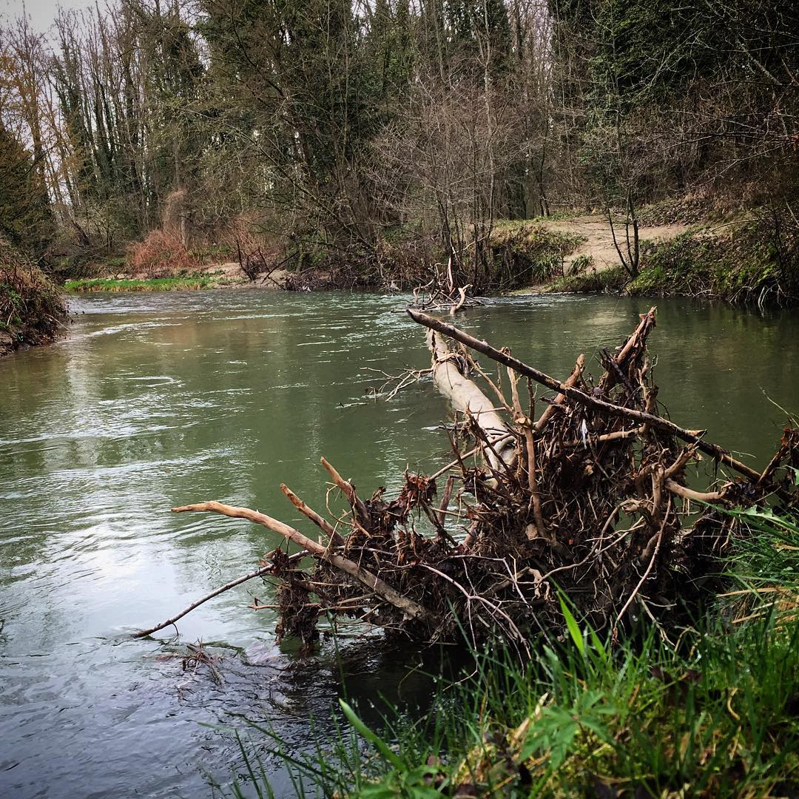

## Machine Learning for Instagram Posts

We found that the json files (hosted in the cluster, hdfs://iccluster046.iccluster.epfl.ch:8020/datasets/goodcitylife/) for Instagram Posts contain a field called sentiment, and that around 1 million and a half instagram posts that field is not NULL (this means, we have either "POSITIVE", "NEUTRAL" or "NEGATIVE), and also that around 6 million and a half have NULL in that field (don't have a sentiment), then we can create both a Train data set and a Test data set, from which we can train a model to predict and therefore to have the sentiment labels for all those instagram posts that don't have (test data).

We decided not to train an image classificator since the pictures we have don't make sense with their respective sentiment, examples of these are:

**Positive picture 1:**

**Postive picture 2:**

**Neutral picture:**

**Negative picture:**

Another reason that we didn't use the pictures to create a classifier is the amount of time that will take to download around **8 million and a half pictures** and to train a model and to predict all the labels that are missing.

That's why we chose to use a text classificator using **FastText**, which can achieve a really high and fast performance as well as giving very goods results in terms of accuracy.

In the jupyter notebook presented here, we detail all the process to build the classifier as well as to get the predictions from the data we collected from the cluster.
