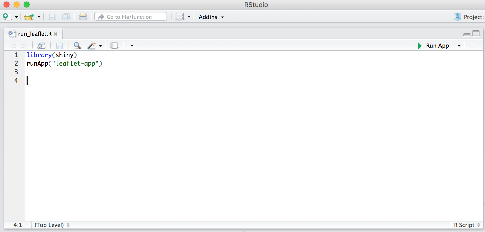

# swiss_sentiment_map
Interactive Visualization for Twitter Sentiment Across Switzerland. Please check out our video demo:

[](https://www.youtube.com/watch?v=qdTp-QBqTcc)


The maps were created with the information we got from the json files (in the cluster) corresponding to the twitter data. Please, refer to the jupyter notebook `/data_wrangling/twitter_cleaning.ipynb` to see how we got the csv file (`/interactive_visualization/data/twitter.csv`) that we used for generating the map.

**NOTE:** Before trying to run the application for displaying the map, please be sure you meet with the following:

* R as well as R Studio have to be installed\*
* The following packets in R need to be also installed (we are writing also the version we used):
  * sp (Classes and Methods for Spatial Data, version 1.2-4)  `install_packages("sp")`
  * rgdal (Bindings for Geospatial Data Abstraction Library, version 1.2-5) `install_packages("rgdal")`
  * shiny (Web Application Framework for R, version 1.0) `install_packages("shiny")`

To run the file:
The simplest way is to run our app from remote source (Github) with following code in RStudio (assuming that RStudio and Shiny are installed):

```R
library(shiny)
shiny::runGitHub("swiss_sentiment_map", "tbfang")
```

Alternatively, it is possible to clone the repository, run the app with the following steps:

* Open the `run_leaflet.R` file in R Studio, this file is localized in the root directory of this repository



* Change the directory to the root directory of this repository (where both the `run_leaflet.R` file and the `interactive_visualization` folder are) (go to "Session -> Set Working Directory -> Choose Directory…")


* Press the "Run app" button localizad in the same `run_leaflet.R` pane


After performing the mentioned steps, a new window of R Studio will be displayed showing the application for the interactive map:


Due to the map is interactive, one can change the filters we want to apply for displaying the map such as the gender (male/female/both), language (English, German, French, All), time of the day (Day, Night, All) or select a specific month or a range of months (1 for January, 2 for February and so on until 10 for october). One also can hover over the cantons to see the sentiment value corresponding to it.

**Examples of filters:**
* Gender: Female
* Language: English
* Time of the day: Night
* Months: 7-10 (from july to october)


* Gender: Both
* Language: All
* Time of the day: All
* Months: 5 (May)


\*For more information, please refer to https://www.r-project.org and https://www.rstudio.com
